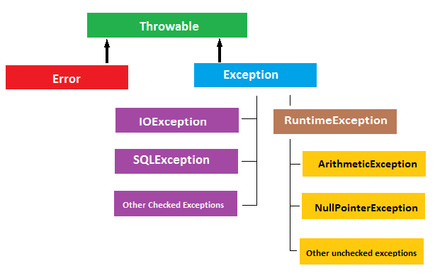

# Checked Exception과 Unchecked Exception

## 분류
Exception의 종류는 크게 Runtime Exception과 그 외로 나뉜다.  
runtime Exception은 unchecked exception이며, 나머지는 checked exception이다.

  
(출처: beingjavaguys.com)

## 차이
|     | Checked | Unchecked |
| :-: | ------- | --------- |
| 처리방법 | 명시적으로 처리(try/catch 등) | 처리 안해도 됨 |
| 트랜잭션 | 예외 발생시 rollback 안함 | rollback 함 |

## 처리 방법
- Checked Exception을 만나면, 구체적인 Unchecked exception을 발생시켜 정확한 정보전달을 하라고 권장함. (난 checked exception이 좋은데...)
- 단, 예외 복구 전략이 명확하고 가능하다면, Checked exception을 써도 된다.